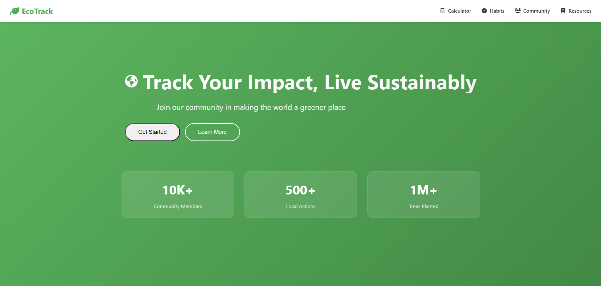

# 🌱 EcoTrack - Your Sustainability Companion

## Problem Statement Addressed
"How might we build and deploy technology-driven solutions that actively promote cleaner, greener communities and environmental sustainability?"

## Project Overview
EcoTrack is a web application designed to help individuals track and reduce their carbon footprint. It provides tools for calculating carbon impact, tracking sustainable habits, and connecting with a community of environmentally conscious individuals. The platform educates users about sustainable living while providing actionable insights to reduce their environmental impact.

## Key Features
- **Carbon Footprint Calculator**: Calculate your weekly carbon impact from transportation and energy usage
- **Habit Tracker**: Monitor and improve your sustainable habits with daily tracking
- **Community Actions**: Join local sustainability initiatives and challenges
- **Educational Resources**: Learn about sustainable living practices
- **Impact Visualization**: See your environmental impact in easy-to-understand metrics

## Screenshot

## Technologies Used
- HTML5, CSS3, JavaScript (ES6+)
- Font Awesome for icons
- Responsive design for all devices

## Getting Started
1. Clone the repository
2. Open `index.html` in a modern web browser
3. Start tracking your sustainable habits and carbon footprint

## Team Members
- Ananthakrishnan K V - Project Lead & Developer
- Abhijith P - Developer
- NAndhakumar K S - Developer
- Alex Roy - UI/UX

## Future Enhancements
- User accounts for saving progress
- Mobile app version
- Integration with smart home devices
- Local community events and challenges

## License
This project is open source and available under the MIT License.
